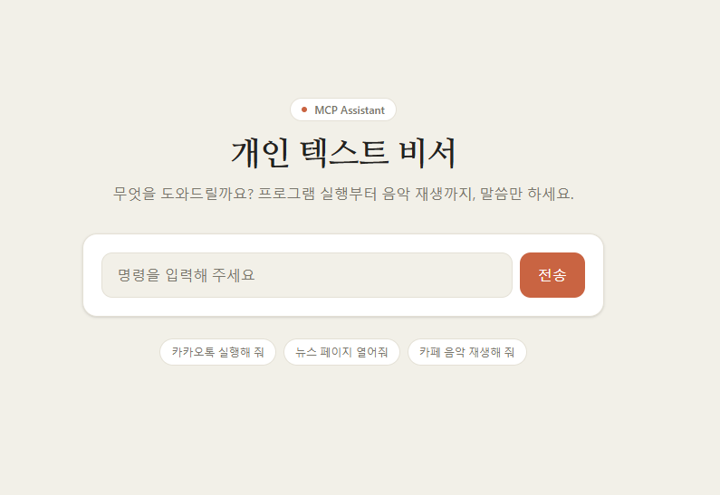
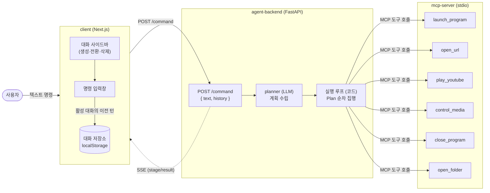

# MCP Assistant

텍스트로 명령을 내리면 PC를 대신 조작해주는 개인 비서입니다. "카카오톡 실행해 줘", "뉴스 페이지 열어줘", "카페 음악 재생해 줘" 같은 문장을 입력하면, LLM이 의도를 파악해 실제 프로그램 실행·URL 열기·유튜브 재생 같은 OS 액션으로 옮겨줍니다.



## 왜 이런 구조인가

일반적인 챗봇은 텍스트로 답만 하지만, 이 프로젝트는 실제로 로컬 PC에 손을 대야 합니다(`os.startfile`, `webbrowser.open` 등). 그래서 "LLM이 도구를 호출하는 부분"과 "도구가 실제로 OS를 건드리는 부분"을 완전히 분리했습니다.

- Agent 백엔드는 사용자 문장을 해석하고 어떤 도구를 어떤 순서로 부를지 계획만 세웁니다.
- MCP 서버는 그 계획을 받아 실제로 프로그램을 켜고, 브라우저를 열고, 유튜브를 재생하는 실행 담당입니다.

이렇게 나눠두면 Agent 백엔드는 순수하게 "무엇을 할지 판단하는" 역할에 집중할 수 있고, MCP 서버는 나중에 다른 LLM이나 다른 클라이언트에서도 그대로 재사용할 수 있습니다.

## 아키텍처



클라이언트는 활성 대화에 쌓인 이전 턴들을 `history`로 함께 실어 `/command`를 호출합니다. planner는 이 `history`를 "이전 대화" 맥락으로 참고해 어떤 도구를 어떤 인자로 부를지 계획을 세우고, 실행 루프(코드)가 그 계획의 각 단계를 MCP 서버에 순서대로 실행시킵니다. 진행 상황과 결과는 SSE로 클라이언트에 실시간 스트리밍되고, 결과가 도착하면 클라이언트가 그 턴을 `localStorage`에 저장합니다. 대화·맥락의 주인은 클라이언트이며, Agent 백엔드는 요청 간 아무 상태도 보관하지 않는 무상태 서버입니다.

## 구성

```
client/         Next.js 텍스트 입력 UI (localhost:3000) — 여러 대화를 만들어 이어서 대화할 수 있고, 각 대화는 브라우저 localStorage에 저장됩니다.
agent-backend/  FastAPI + AutoGen(Gemini) Agent 백엔드 (localhost:8000)
mcp-server/     로컬 네이티브 MCP 서버 — 실제 OS 액션 수행
```

세 프로젝트가 어떻게 맞물리는지는 이렇습니다. 클라이언트에서 문장을 보내면 → Agent 백엔드가 SSE로 진행 상황을 스트리밍하면서 → 내부적으로 planner 에이전트가 계획을 세우고 → 실행 루프가 stdio로 띄운 MCP 서버의 도구(`launch_program`, `open_url`, `play_youtube`, `control_media`, `close_program`, `open_folder`)를 순서대로 호출합니다. 각 폴더의 README에 더 자세한 설명이 있습니다.

- [client/README.md](client/README.md)
- [agent-backend/README.md](agent-backend/README.md)
- [mcp-server/README.md](mcp-server/README.md)

## 사전 요구사항

- **Windows** — `mcp-server`가 `winreg`, `os.startfile` 등 Windows 전용 API를 직접 사용합니다. macOS/Linux에서는 동작하지 않습니다.
- **Python 3** — `agent-backend`, `mcp-server` 둘 다 필요합니다(레포에 최소 버전이 고정되어 있지 않습니다).
- **Node.js** — `client`(Next.js 16) 실행에 필요합니다. Next.js 16의 요구 버전을 따르시면 됩니다.
- **Gemini API 키** — [Google AI Studio](https://aistudio.google.com/)에서 발급.

## MCP 서버 결합

`agent-backend/mcp_servers.json`(Claude Desktop 표준 `mcpServers` 형식)에 서버를 등록하면 그 도구를 비서가 사용할 수 있습니다. 로컬 mcp-server도 `local` 항목으로 등록되어 있습니다.

```json
{
  "mcpServers": {
    "local": { "command": "...python.exe", "args": ["...server.py"] },
    "filesystem": { "command": "npx", "args": ["-y", "@modelcontextprotocol/server-filesystem", "C:\\Users\\me\\Downloads"] }
  }
}
```

- `command`+`args` → 로컬(stdio) 서버, `url` → 원격(HTTP) 서버.
- 클라이언트 `/servers` 페이지에서 목록 확인·추가·삭제가 가능하고, 메인 화면(`/`)의 "+ MCP 추가" 버튼으로 모달을 열어 페이지 이동 없이 바로 추가할 수도 있습니다.
- ⚠️ **보안:** `/servers`에서 서버를 추가한다는 것은 임의의 명령을 호스트에서 실행시킨다는 의미입니다. 신뢰할 수 있는 서버만 등록하세요. Agent 백엔드는 `127.0.0.1`(루프백)에만 바인딩되어 외부 네트워크에서는 접근할 수 없지만, `/mcp-servers` API 자체에는 인증이 없으므로 이 PC를 사용하는 다른 프로세스나 사용자도 호출할 수 있다는 점을 유의하세요.

## 대화 기억 & 여러 대화 관리

메인 화면 왼쪽 사이드바에서 여러 대화를 만들고 이어서 대화할 수 있습니다.

- **맥락 이어받기** — 같은 대화 안에서는 "메모장 열어줘" 다음에 "그거 닫아줘"처럼 이전 명령을 이어받는 후속 명령이 가능합니다. 클라이언트가 활성 대화의 이전 턴들을 `history`로 함께 보내면, Agent 백엔드가 이를 "이전 대화" 프리앰블로 조립해 planner에 전달합니다.
- **여러 대화 + 전환** — 사이드바의 "+ 새 대화"로 새 맥락을 시작하거나, 목록에서 기존 대화를 클릭해 전환할 수 있습니다. 다른 대화로 전환하면 `history`도 그 대화의 턴으로 바뀌므로 대화 간 맥락이 섞이지 않습니다.
- **영속화** — 대화 목록은 브라우저 `localStorage`에 저장됩니다. 새로고침하거나 브라우저를 껐다 켜도 유지되며, 서버에는 아무것도 저장되지 않습니다(Agent 백엔드는 여전히 무상태). 턴이 하나도 없는 빈 대화는 저장하지 않습니다.
- **제목 · 삭제** — 대화 제목은 첫 명령에서 자동 생성됩니다(이름 변경 기능은 없음). 사이드바에서 대화별로 삭제할 수 있습니다.

## 환경변수

| 변수 | 위치 | 기본값 | 설명 |
|------|------|--------|------|
| `GEMINI_API_KEY` | agent-backend/.env | (필수) | Gemini API 키 |
| `GEMINI_MODEL` | agent-backend/.env | `gemini-2.0-flash` | 사용할 Gemini 모델 |
| `PLANNER_MODEL` | agent-backend/.env | `GEMINI_MODEL` | 유일한 LLM 에이전트(planner) 전용 모델(선택) |
| `AGENT_PORT` | agent-backend/.env | `8000` | Agent 백엔드 포트 |
| `CORS_ALLOW_ORIGIN` | agent-backend/.env | `http://localhost:3000` | 허용할 클라이언트 오리진 |
| `NEXT_PUBLIC_AGENT_URL` | client/.env.local | `http://localhost:8000` | 클라이언트가 호출할 백엔드 URL |

## 실행

1. `.env.example`을 참고해 `agent-backend/.env`와 `client/.env.local`을 작성합니다.
2. Agent 백엔드 + MCP 서버 준비·기동:
   ```powershell
   ./run.ps1
   ```
3. 새 터미널에서 클라이언트 기동:
   ```powershell
   npm --prefix client install
   npm --prefix client run dev
   ```
4. 브라우저에서 `http://localhost:3000` 접속.

## 데모 명령

- `카카오톡 실행해 줘` — 설치된 프로그램 실행
- `뉴스 페이지 열어줘` — URL 열기
- `카페 음악 재생해 줘` — 유튜브 검색 후 재생
- `크롬 열고 뉴스 보여줘` — 위 동작을 여러 단계로 묶은 복합 명령
- `볼륨 올려줘` — 미디어/볼륨 제어
- `메모장 닫아줘` — 실행 중인 프로그램 종료
- `다운로드 폴더 열어줘` — 주요 폴더 열기
