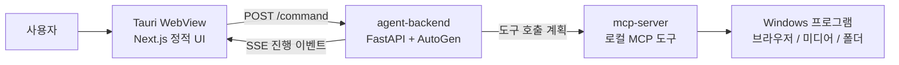

# MCP Assistant

MCP Assistant는 자연어 명령으로 로컬 PC 작업을 실행하는 Windows 데스크톱 앱입니다. 사용자가 "카카오톡 실행해 줘", "네이버 열어 줘", "카페 음악 재생해 줘"처럼 입력하면 LLM이 실행 계획을 만들고, MCP 서버가 실제 OS 동작을 수행합니다.

현재 구조는 Tauri 데스크톱 앱을 기준으로 합니다. `client`는 정적 Next.js UI로 빌드되고, `agent-backend`와 `mcp-server`는 PyInstaller 실행 파일로 패키징되어 Tauri 리소스로 포함됩니다.


## 핵심 구조



- `client`: Next.js 16 기반 화면입니다. 명령 입력, 대화 목록, MCP 서버 관리 UI를 담당합니다.
- `src-tauri`: Tauri 앱 셸입니다. 창을 띄우고 `agent-backend.exe`를 자식 프로세스로 실행합니다.
- `agent-backend`: FastAPI 서버입니다. LLM으로 실행 계획을 만들고 MCP 서버 도구를 호출합니다.
- `mcp-server`: Windows 로컬 작업을 실행하는 MCP 서버입니다.

## 디렉터리

```text
client/         Next.js 정적 UI
src-tauri/      Tauri 데스크톱 앱 설정과 Rust 런타임
agent-backend/  FastAPI + AutoGen 기반 에이전트 백엔드
mcp-server/     Windows 로컬 작업 MCP 서버
assets/         README 이미지 등 정적 자료
dist/           PyInstaller 빌드 산출물
build/          PyInstaller 중간 산출물
```

## 사전 요구사항

- Windows
- Python 3
- Node.js
- Rust 및 Tauri 빌드 환경
- Gemini API 키

## 환경변수

개발 환경과 설치형 Tauri 앱의 환경변수 위치가 다릅니다.

| 변수 | 개발 위치 | 설치형 Tauri 위치 | 기본값 | 설명 |
| --- | --- | --- | --- | --- |
| `GEMINI_API_KEY` | `agent-backend/.env` | `%APPDATA%\mcp-assistant\.env` | 필수 | Gemini API 키 |
| `GEMINI_MODEL` | `agent-backend/.env` | `%APPDATA%\mcp-assistant\.env` | `gemini-2.0-flash` | 기본 Gemini 모델 |
| `PLANNER_MODEL` | `agent-backend/.env` | `%APPDATA%\mcp-assistant\.env` | `GEMINI_MODEL` | planner 전용 모델 |
| `AGENT_PORT` | `agent-backend/.env` | `%APPDATA%\mcp-assistant\.env` | `8000` | 백엔드 포트 |
| `CORS_ALLOW_ORIGIN` | `agent-backend/.env` | `%APPDATA%\mcp-assistant\.env` | `http://localhost:3000` | 허용할 프론트엔드 origin |
| `AGENT_TOKEN` | `run.ps1`이 자동 생성 | 앱 실행 시 자동 생성 | 없음 | 백엔드 API 인증 토큰 |
| `NEXT_PUBLIC_AGENT_URL` | `client/.env.local` | 빌드 시 정적 UI에 포함 | `http://localhost:8000` | 클라이언트가 호출할 백엔드 URL |
| `NEXT_PUBLIC_AGENT_TOKEN` | `run.ps1`이 자동 생성 | 사용하지 않음 | 없음 | 개발 모드 클라이언트 인증 토큰 |

설치형 Tauri 앱은 `.env`를 설치 파일에 포함하지 않습니다. 실행 시 Tauri 런타임이 `%APPDATA%\mcp-assistant\.env`를 읽어 `agent-backend.exe`의 환경변수로 주입합니다.

설치형 앱 실행 전에 다음 파일을 만들어야 합니다.

```text
%APPDATA%\mcp-assistant\.env
```

예시:

```env
GEMINI_API_KEY=발급받은_API_키
GEMINI_MODEL=gemini-2.5-flash
AGENT_PORT=8000
```

일반 설치본에서는 `AGENT_TOKEN`과 `NEXT_PUBLIC_AGENT_TOKEN`을 직접 설정하지 않습니다. 앱이 실행될 때마다 인증 토큰을 자동으로 만들고 백엔드와 화면에 주입합니다.

Tauri 설치본에서 CORS 오류가 발생하면 오류 메시지나 개발자 도구의 요청 `Origin` 값을 확인한 뒤 `CORS_ALLOW_ORIGIN`을 같은 값으로 조정합니다. 개발 모드 기본값은 `http://localhost:3000`입니다.

## 안전하게 사용하기

MCP Assistant는 자연어 명령을 받아 로컬 PC에서 실제 작업을 실행합니다. 일반 사용자는 다음 항목만 신경 쓰면 됩니다.

- 설치 파일에는 API 키가 포함되지 않습니다. 설치 후 `%APPDATA%\mcp-assistant\.env`에 `GEMINI_API_KEY`를 직접 작성합니다.
- 화면, 로그, 설정 파일에 표시되는 API 키나 인증 토큰은 다른 사람에게 공유하지 않습니다.
- 기본 내장 MCP 서버는 앱이 자동으로 찾습니다. 배포본 사용자는 `mcp-server.exe` 경로나 개발자 PC 경로를 직접 수정할 필요가 없습니다.
- MCP 서버를 추가할 때는 신뢰할 수 있는 서버만 등록합니다. MCP 서버는 로컬 프로그램 실행, 브라우저 열기, 폴더 열기 같은 작업을 수행할 수 있습니다.
- 원격 MCP 서버 URL은 `https`만 등록할 수 있고, 로컬/사설 네트워크 주소는 차단됩니다.
- 앱이 예상과 다른 작업을 수행하면 해당 MCP 서버를 삭제하거나 앱을 종료한 뒤 설정을 확인합니다.

## 의존성 준비

Tauri 개발 실행이나 설치 파일 빌드를 하기 전에 처음 한 번 의존성을 준비합니다.

```powershell
npm install
npm --prefix client install
python -m venv agent-backend/.venv
.\agent-backend\.venv\Scripts\python.exe -m pip install -r agent-backend/requirements.txt
python -m venv mcp-server/.venv
.\mcp-server\.venv\Scripts\python.exe -m pip install -r mcp-server/requirements.txt
```

## 개발 실행

개발 중에는 백엔드와 프론트엔드를 분리해서 실행합니다.

1. 백엔드 환경변수를 작성합니다.

   ```powershell
   Copy-Item .env.example agent-backend/.env
   ```

   `agent-backend/.env`의 `GEMINI_API_KEY` 값을 채웁니다.

2. 백엔드와 MCP 서버 가상환경을 준비하고 백엔드를 실행합니다.

   ```powershell
   ./run.ps1
   ```

3. 다른 터미널에서 클라이언트를 실행합니다.

   ```powershell
   npm --prefix client install
   npm --prefix client run dev
   ```

4. 브라우저에서 접속합니다.

   ```text
   http://localhost:3000
   ```

## Tauri 개발 실행

Tauri 창까지 확인하려면 먼저 백엔드와 MCP 서버 실행 파일을 만들어야 합니다.

`의존성 준비`를 마친 뒤 실행 파일을 만들고 Tauri 개발 모드를 실행합니다.

```powershell
./mcp-server/build.ps1
./agent-backend/build.ps1
npm run tauri dev
```

Tauri 개발 실행도 `%APPDATA%\mcp-assistant\.env`를 사용합니다.

## 설치 파일 빌드

Tauri 설치 파일을 만들 때는 Python 백엔드와 MCP 서버를 먼저 PyInstaller로 패키징한 뒤 Tauri 빌드를 실행합니다.

`의존성 준비`를 마친 뒤 설치 파일을 빌드합니다.

```powershell
./mcp-server/build.ps1
./agent-backend/build.ps1
npm run tauri build
```

산출물은 다음 경로 아래에 생성됩니다.

```text
src-tauri/target/release/bundle/
```

`npm run tauri build`는 `src-tauri/tauri.conf.json`의 `beforeBuildCommand`를 통해 `client` 정적 빌드를 함께 실행합니다.

## 번들링 정책

Tauri 설치 파일에는 다음 리소스만 포함합니다.

- `dist/agent-backend/agent-backend.exe`
- `dist/agent-backend/_internal/`
- `dist/agent-backend/mcp_servers.json`
- `dist/mcp-server/`
- `client/out`

다음 파일은 설치 파일에 포함하지 않습니다.

- `agent-backend/.env`
- `dist/agent-backend/.env`
- `client/.env.local`

민감한 값은 반드시 `%APPDATA%\mcp-assistant\.env`에 둡니다.

## MCP 서버 관리

기본 MCP 서버는 `agent-backend/mcp_servers.json`의 `local` 항목입니다. 이 항목은 `{ "bundled": true }`로 선언하고, 개발 환경에서는 저장소의 `mcp-server/server.py`, 설치형 빌드에서는 번들된 `mcp-server.exe`를 가리키도록 런타임에 보정됩니다.

개발 환경의 MCP 서버 목록은 `agent-backend/mcp_servers.json`에 저장됩니다. 설치형 앱은 `%APPDATA%\mcp-assistant\mcp_servers.json`을 사용합니다. 설치형 앱에서 사용자 설정 파일이 없으면 번들된 기본 설정을 최초 1회 복사하며, 이후 앱 업데이트에서는 기존 사용자 설정을 덮어쓰지 않습니다.

백엔드는 MCP 서버 목록 관리를 위해 다음 API를 제공합니다.

- `GET /mcp-servers`: 등록된 MCP 서버 목록 조회
- `POST /mcp-servers`: MCP 서버 추가
- `DELETE /mcp-servers/{name}`: MCP 서버 삭제

클라이언트의 MCP 서버 관리 화면에서도 같은 API를 사용합니다. MCP 서버를 추가하면 해당 서버가 로컬 작업 실행 범위에 들어오므로, 출처와 동작을 이해한 서버만 등록합니다.

MCP 서버 추가 모달은 `mcpServers` 객체 형식과 단일 서버 형식을 모두 받습니다.

로컬 stdio 서버 예시:

```json
{
  "mcpServers": {
    "filesystem": {
      "command": "npx",
      "args": ["-y", "@modelcontextprotocol/server-filesystem", "C:\\Users\\사용자명\\Documents"]
    }
  }
}
```

원격 서버 예시:

```json
{
  "name": "remote-tools",
  "url": "https://example.com/mcp"
}
```

`command` 방식은 로컬에서 명령을 실행합니다. `args`는 하나의 문자열이 아니라 인자 배열로 작성합니다.

## 개발자 참고 API

- `GET /health`: 백엔드 상태 확인
- `POST /command`: 자연어 명령 실행 요청, SSE 스트림 반환
- `GET /mcp-servers`: MCP 서버 목록 조회
- `POST /mcp-servers`: MCP 서버 추가
- `DELETE /mcp-servers/{name}`: MCP 서버 삭제

`POST /command` 요청 예시:

```json
{
  "text": "카페 음악 재생해 줘",
  "history": []
}
```

## 예시 명령

- `카카오톡 실행해 줘`
- `네이버 열어 줘`
- `카페 음악 재생해 줘`
- `볼륨 올려 줘`
- `메모장 꺼 줘`
- `다운로드 폴더 열어 줘`

## 문제 해결

- 앱 시작 시 API 키 파일 오류가 나오면 `%APPDATA%\mcp-assistant\.env`가 있는지 확인합니다.
- `GEMINI_API_KEY`가 없으면 `agent-backend`가 시작되지 않습니다.
- 개발 모드에서 클라이언트가 백엔드에 연결하지 못하면 `./run.ps1`이 실행 중인지 확인합니다.
- 설치본에서 클라이언트 요청이 CORS로 막히면 `%APPDATA%\mcp-assistant\.env`의 `CORS_ALLOW_ORIGIN` 값을 조정합니다.
- Tauri 빌드 전에 `dist/agent-backend/agent-backend.exe`와 `dist/mcp-server/mcp-server.exe`가 생성되어 있어야 합니다.
- 기본 `local` MCP 서버의 경로를 직접 수정하지 않습니다. 개발 환경과 설치형 앱 모두 실행 시점에 알맞은 경로로 자동 보정됩니다.
- MCP 서버가 연결 실패로 표시되면 서버 실행 명령, 인자 배열, 원격 URL, 필요한 외부 런타임 설치 여부를 확인합니다.
